# Healthcare Prescription Safety & Patient Risk Intelligence Platform
 
## Phase 1: MIMIC-IV Load & Data Exploration 

### Project overview

Healthcare providers need tools to identify high-risk patients, understand readmission patterns, and support medication safety initiatives.

This notebook focuses on loading, exploring, and assessing the quality of data from the MIMIC-IV Demo dataset.

### Objectives

- Load patient, admission and diagnosis datasets

- Data quality assessment

- Identify missing values and duplicates

- Prepare data for integration with OpenFDA adverse event data

### Dataset

Source: MIMIC-IV Demo Dataset (PhysioNet: "https://physionet.org/content/mimic-iv-demo/2.2/")

Tables used:

- patients

- admissions

- diagnoses_icd

## 1. Import Libraries


```python
# Import libraries

import pandas as pd
import numpy as np

import matplotlib.pyplot as plt
import seaborn as sns

pd.set_option("display.max_columns", None)

import warnings
warnings.filterwarnings("ignore")
```

## 2. Load MIMIC Data


```python
## Load MIMIC Data

patients = pd.read_csv("../data/raw/patients.csv.gz")

admissions = pd.read_csv("../data/raw/admissions.csv.gz")

diagnoses = pd.read_csv("../data/raw/diagnoses_icd.csv.gz")
```

## 3. Data Inspection


```python
print("PATIENTS")
display(patients.head())

print("ADMISSIONS")
display(admissions.head())

print("DIAGNOSES")
display(diagnoses.head())
```

    PATIENTS


<div>
<style scoped>
    .dataframe tbody tr th:only-of-type {
        vertical-align: middle;
    }

    .dataframe tbody tr th {
        vertical-align: top;
    }

    .dataframe thead th {
        text-align: right;
    }
</style>
<table border="1" class="dataframe">
  <thead>
    <tr style="text-align: right;">
      <th></th>
      <th>subject_id</th>
      <th>gender</th>
      <th>anchor_age</th>
      <th>anchor_year</th>
      <th>anchor_year_group</th>
      <th>dod</th>
    </tr>
  </thead>
  <tbody>
    <tr>
      <th>0</th>
      <td>10014729</td>
      <td>F</td>
      <td>21</td>
      <td>2125</td>
      <td>2011 - 2013</td>
      <td>NaN</td>
    </tr>
    <tr>
      <th>1</th>
      <td>10003400</td>
      <td>F</td>
      <td>72</td>
      <td>2134</td>
      <td>2011 - 2013</td>
      <td>2137-09-02</td>
    </tr>
    <tr>
      <th>2</th>
      <td>10002428</td>
      <td>F</td>
      <td>80</td>
      <td>2155</td>
      <td>2011 - 2013</td>
      <td>NaN</td>
    </tr>
    <tr>
      <th>3</th>
      <td>10032725</td>
      <td>F</td>
      <td>38</td>
      <td>2143</td>
      <td>2011 - 2013</td>
      <td>2143-03-30</td>
    </tr>
    <tr>
      <th>4</th>
      <td>10027445</td>
      <td>F</td>
      <td>48</td>
      <td>2142</td>
      <td>2011 - 2013</td>
      <td>2146-02-09</td>
    </tr>
  </tbody>
</table>
</div>


    ADMISSIONS


<div>
<style scoped>
    .dataframe tbody tr th:only-of-type {
        vertical-align: middle;
    }

    .dataframe tbody tr th {
        vertical-align: top;
    }

    .dataframe thead th {
        text-align: right;
    }
</style>
<table border="1" class="dataframe">
  <thead>
    <tr style="text-align: right;">
      <th></th>
      <th>subject_id</th>
      <th>hadm_id</th>
      <th>admittime</th>
      <th>dischtime</th>
      <th>deathtime</th>
      <th>admission_type</th>
      <th>admit_provider_id</th>
      <th>admission_location</th>
      <th>discharge_location</th>
      <th>insurance</th>
      <th>language</th>
      <th>marital_status</th>
      <th>race</th>
      <th>edregtime</th>
      <th>edouttime</th>
      <th>hospital_expire_flag</th>
    </tr>
  </thead>
  <tbody>
    <tr>
      <th>0</th>
      <td>10004235</td>
      <td>24181354</td>
      <td>2196-02-24 14:38:00</td>
      <td>2196-03-04 14:02:00</td>
      <td>NaN</td>
      <td>URGENT</td>
      <td>P03YMR</td>
      <td>TRANSFER FROM HOSPITAL</td>
      <td>SKILLED NURSING FACILITY</td>
      <td>Medicaid</td>
      <td>ENGLISH</td>
      <td>SINGLE</td>
      <td>BLACK/CAPE VERDEAN</td>
      <td>2196-02-24 12:15:00</td>
      <td>2196-02-24 17:07:00</td>
      <td>0</td>
    </tr>
    <tr>
      <th>1</th>
      <td>10009628</td>
      <td>25926192</td>
      <td>2153-09-17 17:08:00</td>
      <td>2153-09-25 13:20:00</td>
      <td>NaN</td>
      <td>URGENT</td>
      <td>P41R5N</td>
      <td>TRANSFER FROM HOSPITAL</td>
      <td>HOME HEALTH CARE</td>
      <td>Medicaid</td>
      <td>?</td>
      <td>MARRIED</td>
      <td>HISPANIC/LATINO - PUERTO RICAN</td>
      <td>NaN</td>
      <td>NaN</td>
      <td>0</td>
    </tr>
    <tr>
      <th>2</th>
      <td>10018081</td>
      <td>23983182</td>
      <td>2134-08-18 02:02:00</td>
      <td>2134-08-23 19:35:00</td>
      <td>NaN</td>
      <td>URGENT</td>
      <td>P233F6</td>
      <td>TRANSFER FROM HOSPITAL</td>
      <td>SKILLED NURSING FACILITY</td>
      <td>Medicare</td>
      <td>ENGLISH</td>
      <td>MARRIED</td>
      <td>WHITE</td>
      <td>2134-08-17 16:24:00</td>
      <td>2134-08-18 03:15:00</td>
      <td>0</td>
    </tr>
    <tr>
      <th>3</th>
      <td>10006053</td>
      <td>22942076</td>
      <td>2111-11-13 23:39:00</td>
      <td>2111-11-15 17:20:00</td>
      <td>2111-11-15 17:20:00</td>
      <td>URGENT</td>
      <td>P38TI6</td>
      <td>TRANSFER FROM HOSPITAL</td>
      <td>DIED</td>
      <td>Medicaid</td>
      <td>ENGLISH</td>
      <td>NaN</td>
      <td>UNKNOWN</td>
      <td>NaN</td>
      <td>NaN</td>
      <td>1</td>
    </tr>
    <tr>
      <th>4</th>
      <td>10031404</td>
      <td>21606243</td>
      <td>2113-08-04 18:46:00</td>
      <td>2113-08-06 20:57:00</td>
      <td>NaN</td>
      <td>URGENT</td>
      <td>P07HDB</td>
      <td>TRANSFER FROM HOSPITAL</td>
      <td>HOME</td>
      <td>Other</td>
      <td>ENGLISH</td>
      <td>WIDOWED</td>
      <td>WHITE</td>
      <td>NaN</td>
      <td>NaN</td>
      <td>0</td>
    </tr>
  </tbody>
</table>
</div>


    DIAGNOSES


<div>
<style scoped>
    .dataframe tbody tr th:only-of-type {
        vertical-align: middle;
    }

    .dataframe tbody tr th {
        vertical-align: top;
    }

    .dataframe thead th {
        text-align: right;
    }
</style>
<table border="1" class="dataframe">
  <thead>
    <tr style="text-align: right;">
      <th></th>
      <th>subject_id</th>
      <th>hadm_id</th>
      <th>seq_num</th>
      <th>icd_code</th>
      <th>icd_version</th>
    </tr>
  </thead>
  <tbody>
    <tr>
      <th>0</th>
      <td>10035185</td>
      <td>22580999</td>
      <td>3</td>
      <td>4139</td>
      <td>9</td>
    </tr>
    <tr>
      <th>1</th>
      <td>10035185</td>
      <td>22580999</td>
      <td>10</td>
      <td>V707</td>
      <td>9</td>
    </tr>
    <tr>
      <th>2</th>
      <td>10035185</td>
      <td>22580999</td>
      <td>1</td>
      <td>41401</td>
      <td>9</td>
    </tr>
    <tr>
      <th>3</th>
      <td>10035185</td>
      <td>22580999</td>
      <td>9</td>
      <td>3899</td>
      <td>9</td>
    </tr>
    <tr>
      <th>4</th>
      <td>10035185</td>
      <td>22580999</td>
      <td>11</td>
      <td>V8532</td>
      <td>9</td>
    </tr>
  </tbody>
</table>
</div>


## 4. Dataset Dimension


```python
print(f"Patients: {patients.shape}")
print(f"Admissions: {admissions.shape}")
print(f"Diagnoses: {diagnoses.shape}")
```

    Patients: (100, 6)
    Admissions: (275, 16)
    Diagnoses: (4506, 5)


## 5. Data Quality Assessment

- Data types

- Missing values

- Duplicate records

- Outlier Detection

#### Data types


```python
patients.info()
```

    <class 'pandas.DataFrame'>
    RangeIndex: 100 entries, 0 to 99
    Data columns (total 6 columns):
     #   Column             Non-Null Count  Dtype
    ---  ------             --------------  -----
     0   subject_id         100 non-null    int64
     1   gender             100 non-null    str  
     2   anchor_age         100 non-null    int64
     3   anchor_year        100 non-null    int64
     4   anchor_year_group  100 non-null    str  
     5   dod                31 non-null     str  
    dtypes: int64(3), str(3)
    memory usage: 4.8 KB


```python
admissions.info()
```

    <class 'pandas.DataFrame'>
    RangeIndex: 275 entries, 0 to 274
    Data columns (total 16 columns):
     #   Column                Non-Null Count  Dtype
    ---  ------                --------------  -----
     0   subject_id            275 non-null    int64
     1   hadm_id               275 non-null    int64
     2   admittime             275 non-null    str  
     3   dischtime             275 non-null    str  
     4   deathtime             15 non-null     str  
     5   admission_type        275 non-null    str  
     6   admit_provider_id     275 non-null    str  
     7   admission_location    275 non-null    str  
     8   discharge_location    233 non-null    str  
     9   insurance             275 non-null    str  
     10  language              275 non-null    str  
     11  marital_status        263 non-null    str  
     12  race                  275 non-null    str  
     13  edregtime             182 non-null    str  
     14  edouttime             182 non-null    str  
     15  hospital_expire_flag  275 non-null    int64
    dtypes: int64(3), str(13)
    memory usage: 34.5 KB


```python
diagnoses.info()
```

    <class 'pandas.DataFrame'>
    RangeIndex: 4506 entries, 0 to 4505
    Data columns (total 5 columns):
     #   Column       Non-Null Count  Dtype
    ---  ------       --------------  -----
     0   subject_id   4506 non-null   int64
     1   hadm_id      4506 non-null   int64
     2   seq_num      4506 non-null   int64
     3   icd_code     4506 non-null   str  
     4   icd_version  4506 non-null   int64
    dtypes: int64(4), str(1)
    memory usage: 176.1 KB


#### Missing values


```python
patients.isnull().sum()
```


    subject_id            0
    gender                0
    anchor_age            0
    anchor_year           0
    anchor_year_group     0
    dod                  69
    dtype: int64


```python
admissions.isnull().sum()
```


    subject_id                0
    hadm_id                   0
    admittime                 0
    dischtime                 0
    deathtime               260
    admission_type            0
    admit_provider_id         0
    admission_location        0
    discharge_location       42
    insurance                 0
    language                  0
    marital_status           12
    race                      0
    edregtime                93
    edouttime                93
    hospital_expire_flag      0
    dtype: int64


```python
diagnoses.isnull().sum()
```


    subject_id     0
    hadm_id        0
    seq_num        0
    icd_code       0
    icd_version    0
    dtype: int64


#### Duplicate check


```python
print("Patients:", patients.duplicated().sum())

print("Admissions:", admissions.duplicated().sum())

print("Diagnoses:", diagnoses.duplicated().sum())
```

    Patients: 0
    Admissions: 0
    Diagnoses: 0


#### 5. Outlier Detection


```python
patients["anchor_age"].describe()
```


    count    100.00000
    mean      61.75000
    std       16.16979
    min       21.00000
    25%       51.75000
    50%       63.00000
    75%       72.00000
    max       91.00000
    Name: anchor_age, dtype: float64


```python
plt.figure(figsize=(8,4))

sns.boxplot(
    x=patients["anchor_age"]
)

plt.title("Patient Age Outlier Detection")
plt.show()
```


    
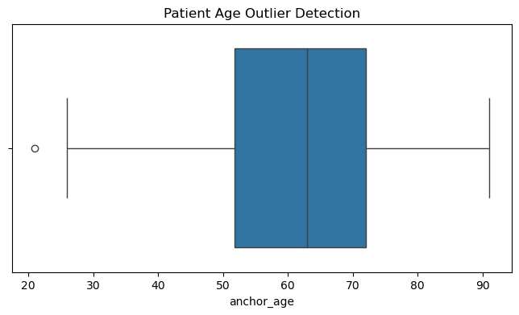
    


## 6. Exploratory Data Analysis

**Business Question 1**

Who are the high-risk patients?


```python
# Patient Age Distribution

plt.figure(figsize=(8,5))

sns.histplot(
    patients["anchor_age"],
    bins=20
)

plt.title("Patient Age Distribution")

plt.show()
```


    
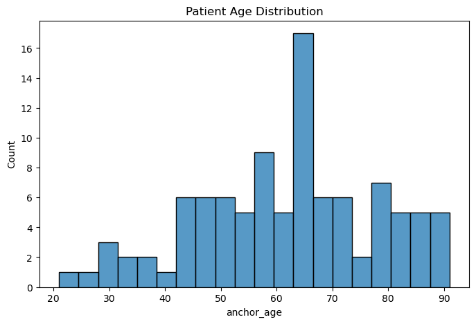
    


```python
# Age Group Distribution

patients["age_group"] = pd.cut(
    patients["anchor_age"],
    bins=[0,18,40,60,80,120],
    labels=[
        "0-18",
        "19-40",
        "41-60",
        "61-80",
        "80+"
    ]
)
```


```python
patients["age_group"].value_counts().sort_index().plot(
    kind="bar",
    color="steelblue"
)

plt.title("Patient Age Groups")
plt.ylabel("Count")
plt.show()
```


    
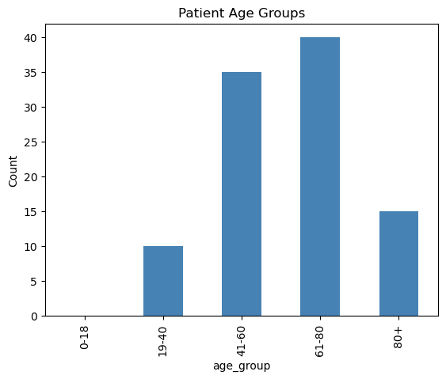
    


```python
# Gender Distribution

patients["gender"].value_counts().plot(
    kind="bar"
)

plt.title("Gender Distribution")
plt.show()
```


    
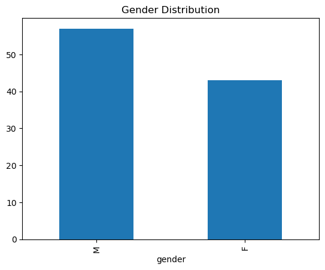
    


**Business Question 4**

Readmission Risk


```python
# Admissions per Patient

admissions_per_patient = (
    admissions.groupby("subject_id")
    .size()
)

plt.figure(figsize=(8,4))

sns.histplot(
    admissions_per_patient,
    bins=10
)

plt.title("Admissions Per Patient")
plt.xlabel("Number of Admissions")
plt.show()
```


    
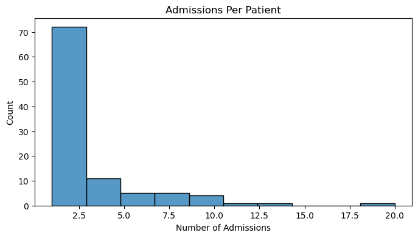
    


**Business Question 1 & 4**
Admission Type Distribution


```python
# Admission Type Distribution

plt.figure(figsize=(10,5))

sns.countplot(
    y="admission_type",
    data=admissions,
    order=admissions["admission_type"].value_counts().index
)

plt.title("Admission Type Distribution")
plt.show()
```


    
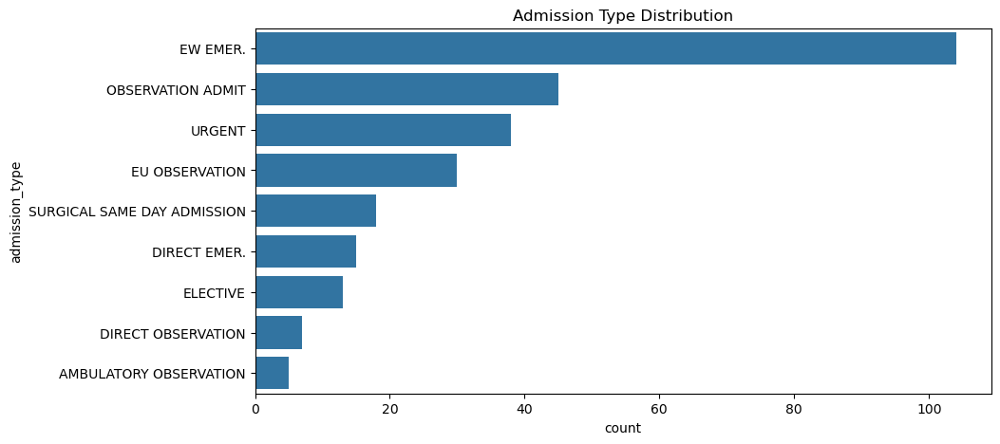
    


**Business Question 4**
Length of Stay Distribution


```python
admissions["admittime"] = pd.to_datetime(
    admissions["admittime"]
)

admissions["dischtime"] = pd.to_datetime(
    admissions["dischtime"]
)
```


```python
admissions["length_of_stay"] = (
    admissions["dischtime"]
    -
    admissions["admittime"]
).dt.days
```


```python
plt.figure(figsize=(8,5))

sns.histplot(
    admissions["length_of_stay"],
    bins=20
)

plt.title("Hospital Length of Stay")
plt.show()
```


    
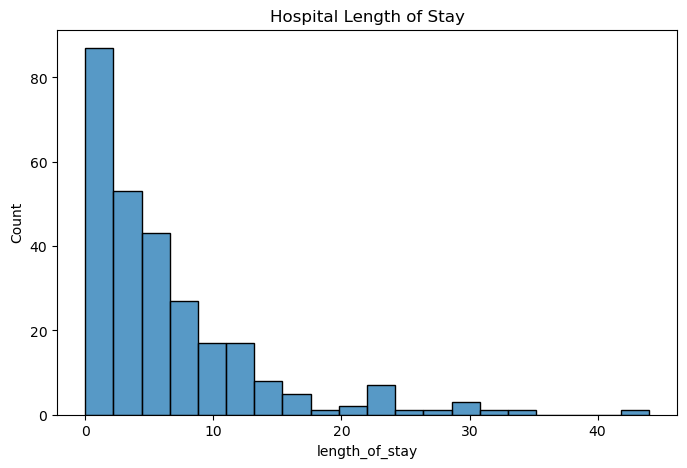
    


**Business Question 3**
Medication Safety / Chronic Disease Signals


```python
top_diagnoses = (
    diagnoses["icd_code"]
    .value_counts()
    .head(15)
)
```


```python
plt.figure(figsize=(10,6))

sns.barplot(
    x=top_diagnoses.values,
    y=top_diagnoses.index
)

plt.title("Top 15 Diagnosis Codes")
plt.show()
```


    
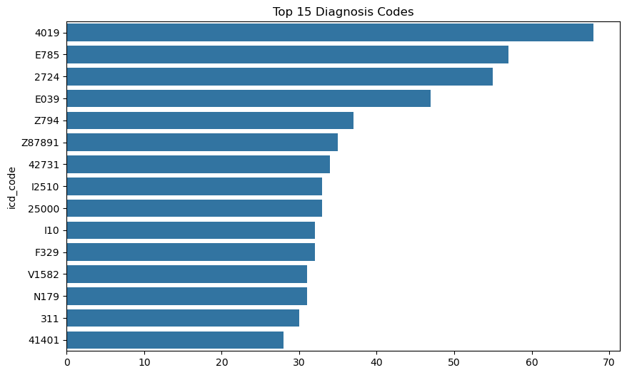
    


**Business Question 1**
Mortality Indicator


```python
admissions["hospital_expire_flag"]\
    .value_counts()\
    .plot(kind="bar")
```


    <Axes: xlabel='hospital_expire_flag'>


    
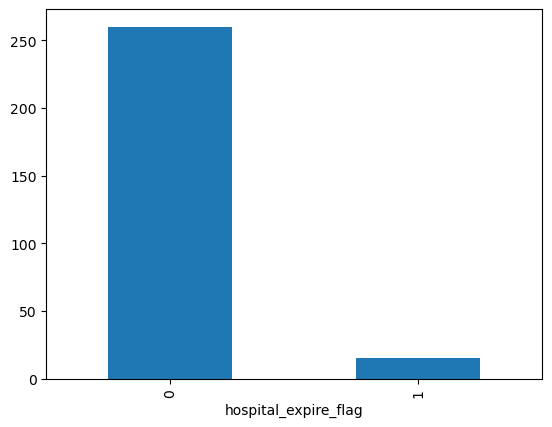
    


```python
plt.figure(figsize=(6,4))

admissions["hospital_expire_flag"]\
    .value_counts()\
    .sort_index()\
    .plot(kind="bar")

plt.title("Hospital Mortality Distribution")
plt.xlabel("Hospital Expire Flag")
plt.ylabel("Number of Admissions")

plt.show()
```


    
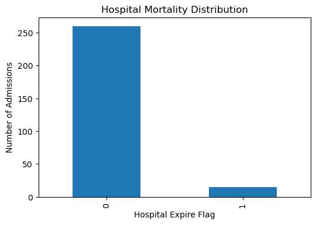
    


```python
plt.figure(figsize=(6,4))

sns.countplot(
    x="hospital_expire_flag",
    data=admissions
)

plt.title("Hospital Mortality Distribution")
plt.xlabel("Hospital Expire Flag")
plt.ylabel("Number of Admissions")

plt.show()
```


    
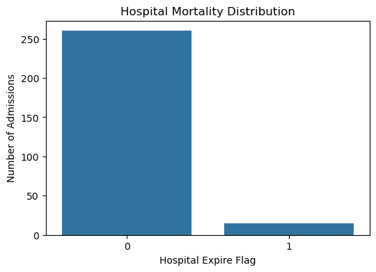
    


```python
mortality = admissions["hospital_expire_flag"]\
    .value_counts(normalize=True)\
    .mul(100)\
    .round(1)

mortality
```


    hospital_expire_flag
    0    94.5
    1     5.5
    Name: proportion, dtype: float64


```python
plt.figure(figsize=(6,4))

sns.countplot(
    x="hospital_expire_flag",
    data=admissions
)

for i, count in enumerate(
    admissions["hospital_expire_flag"].value_counts().sort_index()
):
    plt.text(
        i,
        count + 2,
        str(count),
        ha="center"
)

plt.title("Hospital Mortality Distribution")
plt.xlabel("Hospital Expire Flag")
plt.ylabel("Admissions")

plt.show()
```


    
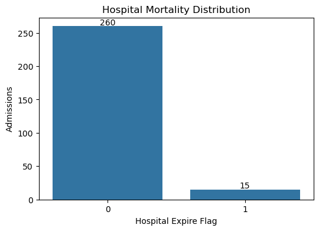
    


# Initial Findings

Key observations from the initial exploration include:

- The patient population is primarily concentrated in older age groups.

- Several patients have multiple hospital admissions, suggesting complex healthcare needs.

- Emergency and urgent admissions represent a significant share of hospital encounters.

- Length of stay varies considerably across admissions.

- A small number of diagnosis codes account for a large proportion of clinical activity.

These findings justify further investigation into patient risk factors, chronic disease burden, and hospital readmission patterns in subsequent analyses.
