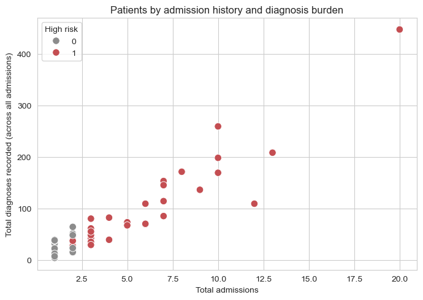
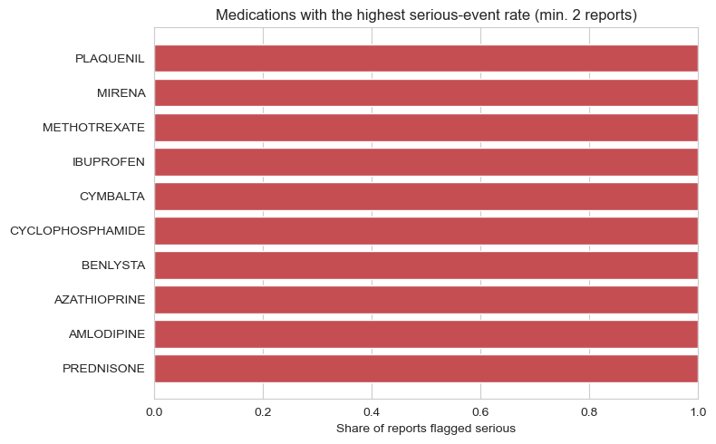
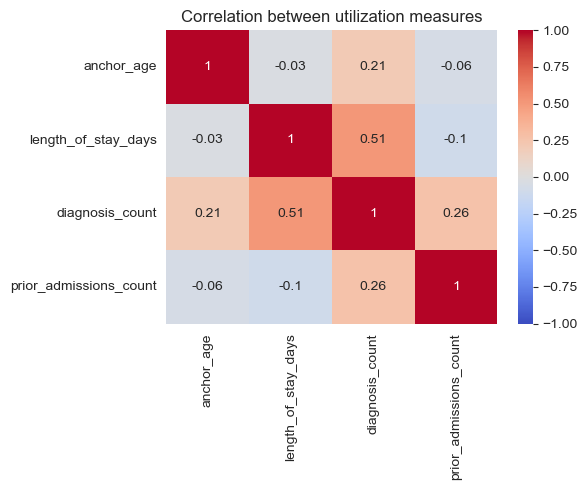

# Healthcare Prescription Safety & Patient Risk Intelligence Platform

## EDA & Statistics

### Purpose

Picking up from where I left off from Notebook 03, I sucessfully managed to export and merge dataset. 

In this notebook 03, I will dive deeper into EDA/visualizationa and statistics around four business questions: 

1. **Who are the highest-risk patients?** (age, diagnoses, admission history)
2. **Which patients are likely to be readmitted?**
3. **What medication safety risks exist?** (OpenFDA adverse event reports)
4. **Which diagnoses drive hospital utilization?** (chronic disease burden)


**Dataset**

From folder `Data/Processed/` (final clean version)


## 1. Import libraries


```python
import pandas as pd
import numpy as np
from scipy import stats

import matplotlib.pyplot as plt
import seaborn as sns

pd.set_option("display.max_columns", None)
pd.set_option("display.width", 200)
sns.set_style("whitegrid")

import warnings
warnings.filterwarnings("ignore")
```

## 2. Load Data (clean version) 


```python
PROCESSED = "../Data/Processed"

clinical_master = pd.read_csv(f"{PROCESSED}/clinical_master.csv")
diagnoses_clean = pd.read_csv(f"{PROCESSED}/diagnoses_clean.csv")
drug_events = pd.read_csv(f"{PROCESSED}/openfda_drug_events_long.csv")
med_ae_master = pd.read_csv(f"{PROCESSED}/med_adverse_event_master.csv")

print("clinical_master:", clinical_master.shape)
print("diagnoses_clean:", diagnoses_clean.shape)
print("drug_events:", drug_events.shape)
print("med_ae_master:", med_ae_master.shape)
```

    clinical_master: (275, 24)
    diagnoses_clean: (4506, 7)
    drug_events: (265, 5)
    med_ae_master: (875, 20)


## 3. Business Q1 — Who are the highest-risk patients?

**Three Factors : `age`, `diagnosis burden`, and `admission history`.**


```python
patient_summary = clinical_master.groupby("subject_id").agg(
    age=("anchor_age", "first"),
    gender=("gender", "first"),
    deceased=("deceased", "first"),
    total_admissions=("hadm_id", "count"),
    total_diagnoses=("diagnosis_count", "sum"),
    avg_length_of_stay=("length_of_stay_days", "mean"),
    ever_readmitted_30d=("readmitted_30d", "max"),
).reset_index()

patient_summary["avg_length_of_stay"] = patient_summary["avg_length_of_stay"].round(1)

print(patient_summary.shape)
patient_summary.head()
```

    (100, 8)


<div>
<style scoped>
    .dataframe tbody tr th:only-of-type {
        vertical-align: middle;
    }

    .dataframe tbody tr th {
        vertical-align: top;
    }

    .dataframe thead th {
        text-align: right;
    }
</style>
<table border="1" class="dataframe">
  <thead>
    <tr style="text-align: right;">
      <th></th>
      <th>subject_id</th>
      <th>age</th>
      <th>gender</th>
      <th>deceased</th>
      <th>total_admissions</th>
      <th>total_diagnoses</th>
      <th>avg_length_of_stay</th>
      <th>ever_readmitted_30d</th>
    </tr>
  </thead>
  <tbody>
    <tr>
      <th>0</th>
      <td>10000032</td>
      <td>52</td>
      <td>F</td>
      <td>1</td>
      <td>4</td>
      <td>39</td>
      <td>1.4</td>
      <td>1</td>
    </tr>
    <tr>
      <th>1</th>
      <td>10001217</td>
      <td>55</td>
      <td>F</td>
      <td>0</td>
      <td>2</td>
      <td>17</td>
      <td>6.4</td>
      <td>1</td>
    </tr>
    <tr>
      <th>2</th>
      <td>10001725</td>
      <td>46</td>
      <td>F</td>
      <td>0</td>
      <td>1</td>
      <td>18</td>
      <td>3.0</td>
      <td>0</td>
    </tr>
    <tr>
      <th>3</th>
      <td>10002428</td>
      <td>80</td>
      <td>F</td>
      <td>0</td>
      <td>7</td>
      <td>114</td>
      <td>5.6</td>
      <td>1</td>
    </tr>
    <tr>
      <th>4</th>
      <td>10002495</td>
      <td>81</td>
      <td>M</td>
      <td>0</td>
      <td>1</td>
      <td>26</td>
      <td>6.9</td>
      <td>0</td>
    </tr>
  </tbody>
</table>
</div>


**Flag Patient as High Risk** based on the following condition: `3+ admissions` or at `one 30-day readmission`.


```python
patient_summary["high_risk"] = (
    (patient_summary["total_admissions"] >= 3) | (patient_summary["ever_readmitted_30d"] == 1)
).astype(int)

print(f"High-risk patients: {patient_summary['high_risk'].sum()} of {len(patient_summary)} "
      f"({patient_summary['high_risk'].mean():.1%})")

patient_summary.sort_values("total_admissions", ascending=False).head(10)
```

    High-risk patients: 35 of 100 (35.0%)


<div>
<style scoped>
    .dataframe tbody tr th:only-of-type {
        vertical-align: middle;
    }

    .dataframe tbody tr th {
        vertical-align: top;
    }

    .dataframe thead th {
        text-align: right;
    }
</style>
<table border="1" class="dataframe">
  <thead>
    <tr style="text-align: right;">
      <th></th>
      <th>subject_id</th>
      <th>age</th>
      <th>gender</th>
      <th>deceased</th>
      <th>total_admissions</th>
      <th>total_diagnoses</th>
      <th>avg_length_of_stay</th>
      <th>ever_readmitted_30d</th>
      <th>high_risk</th>
    </tr>
  </thead>
  <tbody>
    <tr>
      <th>35</th>
      <td>10014354</td>
      <td>60</td>
      <td>M</td>
      <td>0</td>
      <td>20</td>
      <td>447</td>
      <td>4.2</td>
      <td>1</td>
      <td>1</td>
    </tr>
    <tr>
      <th>38</th>
      <td>10015860</td>
      <td>53</td>
      <td>M</td>
      <td>0</td>
      <td>13</td>
      <td>208</td>
      <td>6.3</td>
      <td>0</td>
      <td>1</td>
    </tr>
    <tr>
      <th>5</th>
      <td>10002930</td>
      <td>48</td>
      <td>F</td>
      <td>1</td>
      <td>12</td>
      <td>109</td>
      <td>3.3</td>
      <td>1</td>
      <td>1</td>
    </tr>
    <tr>
      <th>99</th>
      <td>10040025</td>
      <td>64</td>
      <td>F</td>
      <td>1</td>
      <td>10</td>
      <td>259</td>
      <td>6.6</td>
      <td>1</td>
      <td>1</td>
    </tr>
    <tr>
      <th>96</th>
      <td>10039708</td>
      <td>46</td>
      <td>F</td>
      <td>0</td>
      <td>10</td>
      <td>198</td>
      <td>7.5</td>
      <td>1</td>
      <td>1</td>
    </tr>
    <tr>
      <th>90</th>
      <td>10037928</td>
      <td>78</td>
      <td>F</td>
      <td>0</td>
      <td>10</td>
      <td>169</td>
      <td>4.1</td>
      <td>0</td>
      <td>1</td>
    </tr>
    <tr>
      <th>87</th>
      <td>10035631</td>
      <td>63</td>
      <td>M</td>
      <td>1</td>
      <td>9</td>
      <td>136</td>
      <td>13.2</td>
      <td>1</td>
      <td>1</td>
    </tr>
    <tr>
      <th>49</th>
      <td>10019003</td>
      <td>65</td>
      <td>F</td>
      <td>1</td>
      <td>8</td>
      <td>171</td>
      <td>7.7</td>
      <td>1</td>
      <td>1</td>
    </tr>
    <tr>
      <th>3</th>
      <td>10002428</td>
      <td>80</td>
      <td>F</td>
      <td>0</td>
      <td>7</td>
      <td>114</td>
      <td>5.6</td>
      <td>1</td>
      <td>1</td>
    </tr>
    <tr>
      <th>7</th>
      <td>10003400</td>
      <td>72</td>
      <td>F</td>
      <td>1</td>
      <td>7</td>
      <td>153</td>
      <td>11.7</td>
      <td>1</td>
      <td>1</td>
    </tr>
  </tbody>
</table>
</div>


```python
plt.figure(figsize=(7, 5))
sns.scatterplot(
    data=patient_summary,
    x="total_admissions",
    y="total_diagnoses",
    hue="high_risk",
    palette={0: "#8C8C8C", 1: "#C44E52"},
    s=70,
)
plt.title("Patients by admission history and diagnosis burden")
plt.xlabel("Total admissions")
plt.ylabel("Total diagnoses recorded (across all admissions)")
plt.legend(title="High risk")
plt.tight_layout()
plt.show()
```


    

    


Findings: High-risk patients(red) cluster toward more admissions and diagnoses. 

## 4. Q2 — Which patients are likely to be readmitted?

Notebook 03 the results showed group by age (<30), gender(Female), insurance(Medicaid) and admission type(direct emergency

So I will perform a **t-test** to compare the *average* of a numeric variable (age, length of stay, diagnosis count) between the readmitted and not-readmitted groups. **p-value** is the probability of seeing a difference this large by chance alone if there were truly no difference — the usual cutoff is 0.05: below that, I can call it "statistically significant".


```python
readmit_adm = clinical_master[clinical_master["readmitted_30d"] == 1]
not_readmit_adm = clinical_master[clinical_master["readmitted_30d"] == 0]

def compare(col, label):
    t, p = stats.ttest_ind(readmit_adm[col], not_readmit_adm[col], equal_var=False, nan_policy="omit")
    sig = "significant (p < 0.05)" if p < 0.05 else "not significant"
    print(f"{label:22s} readmitted mean={readmit_adm[col].mean():6.1f}   "
          f"not-readmitted mean={not_readmit_adm[col].mean():6.1f}   p={p:.3f}  -> {sig}")

compare("anchor_age", "Age")
compare("length_of_stay_days", "Length of stay")
compare("diagnosis_count", "Diagnosis count")
```

    Age                    readmitted mean=  58.3   not-readmitted mean=  61.7   p=0.102  -> not significant
    Length of stay         readmitted mean=   7.6   not-readmitted mean=   6.7   p=0.342  -> not significant
    Diagnosis count        readmitted mean=  18.0   not-readmitted mean=  16.0   p=0.154  -> not significant


I will also perform a **Chi-square test** which fit best a *categorical* variable and check if `admission_type`and `30-day readmission`are related. 


```python
ct = pd.crosstab(clinical_master["admission_type"], clinical_master["readmitted_30d"])
chi2, p_chi, dof, expected = stats.chi2_contingency(ct)

sig = "significant (p < 0.05)" if p_chi < 0.05 else "not significant"
print(f"admission_type vs readmitted_30d:  chi2={chi2:.2f}, p={p_chi:.3f}  -> {sig}")
ct
```

    admission_type vs readmitted_30d:  chi2=8.31, p=0.404  -> not significant


<div>
<style scoped>
    .dataframe tbody tr th:only-of-type {
        vertical-align: middle;
    }

    .dataframe tbody tr th {
        vertical-align: top;
    }

    .dataframe thead th {
        text-align: right;
    }
</style>
<table border="1" class="dataframe">
  <thead>
    <tr style="text-align: right;">
      <th>readmitted_30d</th>
      <th>0</th>
      <th>1</th>
    </tr>
    <tr>
      <th>admission_type</th>
      <th></th>
      <th></th>
    </tr>
  </thead>
  <tbody>
    <tr>
      <th>AMBULATORY OBSERVATION</th>
      <td>5</td>
      <td>0</td>
    </tr>
    <tr>
      <th>DIRECT EMER.</th>
      <td>10</td>
      <td>5</td>
    </tr>
    <tr>
      <th>DIRECT OBSERVATION</th>
      <td>6</td>
      <td>1</td>
    </tr>
    <tr>
      <th>ELECTIVE</th>
      <td>11</td>
      <td>2</td>
    </tr>
    <tr>
      <th>EU OBSERVATION</th>
      <td>28</td>
      <td>2</td>
    </tr>
    <tr>
      <th>EW EMER.</th>
      <td>79</td>
      <td>25</td>
    </tr>
    <tr>
      <th>OBSERVATION ADMIT</th>
      <td>36</td>
      <td>9</td>
    </tr>
    <tr>
      <th>SURGICAL SAME DAY ADMISSION</th>
      <td>15</td>
      <td>3</td>
    </tr>
    <tr>
      <th>URGENT</th>
      <td>32</td>
      <td>6</td>
    </tr>
  </tbody>
</table>
</div>


Findings: Both the t-test and Chi-square test comes back not significant due to the limited size of the dataset (only 275 admissions and readmission is also a minority outcome) 

## 5. Q3 — What medication safety risks exist?

Notebook 03 ranked medications by *count* (Prednisone, Letairis & Casodex) of adverse-events reports is different from computing each medication's **serious-event rate**: and report that were flagged serious.


```python
serious_ids = (
    med_ae_master.loc[med_ae_master["serious"] == "Yes", ["medicinalproduct", "safetyreportid"]]
    .drop_duplicates()
)
serious_counts = serious_ids.groupby("medicinalproduct").size().rename("serious_reports")

med_stats = drug_events.groupby("medicinalproduct")["safetyreportid"].nunique().rename("total_reports").to_frame()
med_stats = med_stats.join(serious_counts).fillna({"serious_reports": 0})
med_stats["serious_reports"] = med_stats["serious_reports"].astype(int)
med_stats["serious_rate"] = (med_stats["serious_reports"] / med_stats["total_reports"]).round(2)

top_meds = med_stats[med_stats["total_reports"] >= 2].sort_values(
    ["serious_rate", "total_reports"], ascending=False
)
top_meds.head(10)
```


<div>
<style scoped>
    .dataframe tbody tr th:only-of-type {
        vertical-align: middle;
    }

    .dataframe tbody tr th {
        vertical-align: top;
    }

    .dataframe thead th {
        text-align: right;
    }
</style>
<table border="1" class="dataframe">
  <thead>
    <tr style="text-align: right;">
      <th></th>
      <th>total_reports</th>
      <th>serious_reports</th>
      <th>serious_rate</th>
    </tr>
    <tr>
      <th>medicinalproduct</th>
      <th></th>
      <th></th>
      <th></th>
    </tr>
  </thead>
  <tbody>
    <tr>
      <th>PREDNISONE</th>
      <td>7</td>
      <td>7</td>
      <td>1.0</td>
    </tr>
    <tr>
      <th>AMLODIPINE</th>
      <td>2</td>
      <td>2</td>
      <td>1.0</td>
    </tr>
    <tr>
      <th>AZATHIOPRINE</th>
      <td>2</td>
      <td>2</td>
      <td>1.0</td>
    </tr>
    <tr>
      <th>BENLYSTA</th>
      <td>2</td>
      <td>2</td>
      <td>1.0</td>
    </tr>
    <tr>
      <th>CYCLOPHOSPHAMIDE</th>
      <td>2</td>
      <td>2</td>
      <td>1.0</td>
    </tr>
    <tr>
      <th>CYMBALTA</th>
      <td>2</td>
      <td>2</td>
      <td>1.0</td>
    </tr>
    <tr>
      <th>IBUPROFEN</th>
      <td>2</td>
      <td>2</td>
      <td>1.0</td>
    </tr>
    <tr>
      <th>METHOTREXATE</th>
      <td>2</td>
      <td>2</td>
      <td>1.0</td>
    </tr>
    <tr>
      <th>MIRENA</th>
      <td>2</td>
      <td>2</td>
      <td>1.0</td>
    </tr>
    <tr>
      <th>PLAQUENIL</th>
      <td>2</td>
      <td>2</td>
      <td>1.0</td>
    </tr>
  </tbody>
</table>
</div>


```python
top10 = top_meds.head(10).sort_values("serious_rate")

plt.figure(figsize=(8, 5))
plt.barh(top10.index, top10["serious_rate"], color="#C44E52")
plt.xlabel("Share of reports flagged serious")
plt.title("Medications with the highest serious-event rate (min. 2 reports)")
plt.xlim(0, 1)
plt.tight_layout()
plt.show()
```


    

    


**IMPORTANT NOTE** This data is from OpenFDA sample (public feed) not linked to the MIMIC patients. In order to connect the two we would need *`real prescriptions`* with the *`patient ID`*. 

## 6. Q4 — Which diagnoses drive hospital utilization?

`Utilization` correspond to patient using hospital resource by lenght of stay, number of diagnoses reported, how often they come back. 

*`Hypothesis`* Do patient carrying a **chronic condition** (such as diabetes or hypertension) use more than patient with only acute or one-off diagnose)


```python
CHRONIC_LABELS = {
    "Hypertension", "Hyperlipidemia", "Hypothyroidism", "Atrial fibrillation",
    "Type 2 diabetes", "Coronary artery disease", "GERD",
    "Long-term drug therapy (insulin)", "Long-term anticoagulant use",
    "Coronary atherosclerosis (native artery)", "Coronary artery disease with angina",
}

diagnoses_clean["is_chronic"] = diagnoses_clean["diagnosis_label"].isin(CHRONIC_LABELS)
chronic_flag = (
    diagnoses_clean.groupby("hadm_id")["is_chronic"].any()
    .rename("has_chronic_condition")
    .reset_index()
)

cm2 = clinical_master.merge(chronic_flag, on="hadm_id", how="left")
cm2["has_chronic_condition"] = cm2["has_chronic_condition"].fillna(False)

print(f"Admissions involving a chronic condition: {cm2['has_chronic_condition'].sum()} of {len(cm2)} "
      f"({cm2['has_chronic_condition'].mean():.1%})")

cm2.groupby("has_chronic_condition")[["length_of_stay_days", "diagnosis_count", "prior_admissions_count"]].mean().round(2)

```

    Admissions involving a chronic condition: 207 of 275 (75.3%)


<div>
<style scoped>
    .dataframe tbody tr th:only-of-type {
        vertical-align: middle;
    }

    .dataframe tbody tr th {
        vertical-align: top;
    }

    .dataframe thead th {
        text-align: right;
    }
</style>
<table border="1" class="dataframe">
  <thead>
    <tr style="text-align: right;">
      <th></th>
      <th>length_of_stay_days</th>
      <th>diagnosis_count</th>
      <th>prior_admissions_count</th>
    </tr>
    <tr>
      <th>has_chronic_condition</th>
      <th></th>
      <th></th>
      <th></th>
    </tr>
  </thead>
  <tbody>
    <tr>
      <th>False</th>
      <td>6.39</td>
      <td>11.04</td>
      <td>2.26</td>
    </tr>
    <tr>
      <th>True</th>
      <td>7.04</td>
      <td>18.14</td>
      <td>2.84</td>
    </tr>
  </tbody>
</table>
</div>


Admissions involving a chronic condition run noticeably higher on all three utilization measures. 

A **correlation matrix** checks this more directly across all the numeric features at once (values closer to *`1`* or *`-1`* mean two variables move together more strongly).


```python
corr_cols = ["anchor_age", "length_of_stay_days", "diagnosis_count", "prior_admissions_count"]
corr = cm2[corr_cols].corr().round(2)

plt.figure(figsize=(6, 5))
sns.heatmap(corr, annot=True, cmap="coolwarm", vmin=-1, vmax=1, center=0)
plt.title("Correlation between utilization measures")
plt.tight_layout()
plt.show()
```


    

    


**Findings:** 
- `diagnosis_count` and `length_of_stay_days` have the strongest relationship (0.51)
- **admissions** with more recorded diagnoses tend to run longer, which lines up with the chronic-condition comparison above.
- **Age** barely correlates with any of these, suggesting **diagnosis burden** (not age alone) is the better predictor of utilization in this cohort.

## 7 RECAP 


- **`Business Q1`** : `Highest risk patient` -> High-risk patients: 35 of 100 (35.0%)

- **`Business Q2`** : `Readmission` -> inconclusive age, LOS, diagnosis count or admission type are not statistically significant at this sample size (275 admissions)in this dataset I can't confirm it.

- **`Business Q3`** : `Medication safety` -> Ranking by *serious-event rate* demonstrated to be more useful list rsiky medications than notebook 03 raw counts. 

- **`Business Q4`** : `Utilization` -> Admissions involving a chronic condition: 207 of 275 (75.3%) and diagnosis count correlates with lenght of stay(r=0.51) more than age does.
